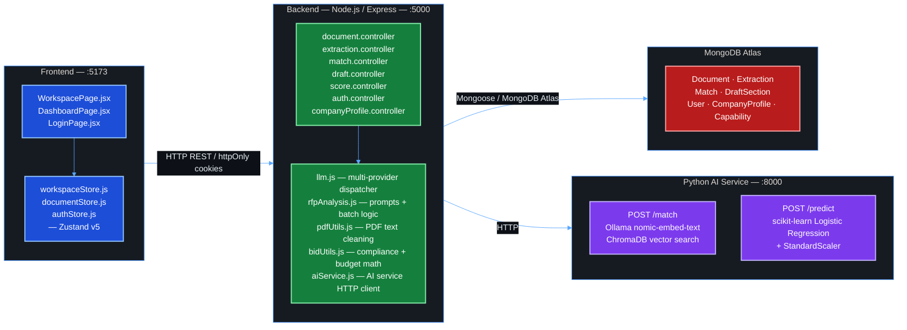
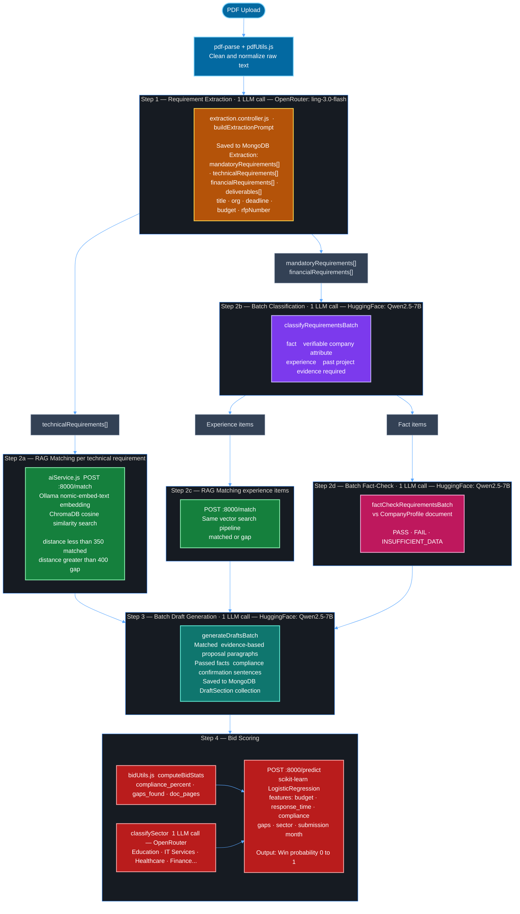

# BidIQ

Responding to RFPs manually is time-consuming. You read through a long document, identify every requirement, figure out which ones your company meets, write a compliance response for each, and then hope your bid scores well enough to win. That whole process — for a single RFP — can easily take days.

BidIQ automates it. Upload the PDF, and it extracts every requirement, runs each one through a RAG pipeline against your historical bid library, generates draft proposal paragraphs for the ones you match, and scores your overall win probability using a trained ML model.

Three services: a Node.js/Express backend, a React frontend, and a Python FastAPI service for vector search and ML scoring.

---

## Table of Contents

- [Features](#features)
- [System Architecture](#system-architecture)
- [Tech Stack](#tech-stack)
- [Project Structure](#project-structure)
- [Getting Started](#getting-started)
  - [Prerequisites](#prerequisites)
  - [1. Backend Setup](#1-backend-setup)
  - [2. AI Service Setup](#2-ai-service-setup)
  - [3. Frontend Setup](#3-frontend-setup)
- [Environment Variables](#environment-variables)
- [API Reference](#api-reference)
- [LLM Provider Routing](#llm-provider-routing)
- [AI Pipeline Overview](#ai-pipeline-overview)
- [Data Models](#data-models)
- [Scripts](#scripts)

---

## What it does

| Step | What happens |
|---|---|
| **PDF Upload** | Upload an RFP or tender PDF. Raw text is extracted and cleaned. |
| **Requirement Extraction** | One LLM call splits the doc into mandatory, technical, and financial requirements. |
| **RAG Matching** | Each technical requirement is embedded and queried against ChromaDB. Distance thresholds decide `matched` vs `gap`. |
| **Classification + Fact-Check** | Mandatory/financial requirements are classified as `fact` or `experience` in one batch call. Facts are checked against the company profile. Experience items go through RAG. |
| **Draft Generation** | Matched requirements get proposal paragraphs written by the LLM, using the matched capability as evidence. |
| **Win Probability** | Compliance %, gap count, sector, budget, and timing are fed into a scikit-learn logistic regression model. |

**Other things it has:** JWT auth with `httpOnly` cookies, multi-workspace support, per-task LLM provider routing (OpenRouter / Hugging Face / Ollama), automatic provider failover.

---

## System Architecture



---

## Tech Stack

### Backend
| Layer | Technology |
|---|---|
| Runtime | Node.js 22 (ESM modules) |
| Framework | Express.js v5 |
| Database | MongoDB Atlas via Mongoose v9 |
| Authentication | JWT (`jsonwebtoken`) + `bcryptjs` + `httpOnly` cookies |
| File Handling | Multer (PDF upload) |
| PDF Parsing | `pdf-parse` |
| Excel Reading | `xlsx` (capability library seeding) |
| Package Manager | pnpm |

### AI Service (Python)
| Layer | Technology |
|---|---|
| Framework | FastAPI |
| Vector Store | ChromaDB (persistent local store) |
| Embeddings | Ollama `nomic-embed-text:latest` |
| Win Prediction | scikit-learn Logistic Regression + StandardScaler |
| Data Processing | pandas |

### Frontend
| Layer | Technology |
|---|---|
| Framework | React 19 + Vite 8 |
| Styling | TailwindCSS v4 |
| State Management | Zustand v5 |
| HTTP Client | Axios |
| Icons | Lucide React |
| Notifications | react-hot-toast |
| Routing | React Router DOM v7 |

### LLM Providers
| Task | Default Provider | Model |
|---|---|---|
| Extraction | OpenRouter | `inclusionai/ling-3.0-flash:free` |
| Matching | Hugging Face | `Qwen/Qwen2.5-7B-Instruct` |
| Draft | Hugging Face | `Qwen/Qwen2.5-7B-Instruct` |
| Scoring | OpenRouter | `inclusionai/ling-3.0-flash:free` |

---

## Project Structure

```
BidIQ/
├── backend/                        # Node.js / Express API
│   ├── src/
│   │   ├── app.js                  # Express app entry point
│   │   ├── config/
│   │   │   └── db.js               # MongoDB connection
│   │   ├── controllers/
│   │   │   ├── auth.controller.js
│   │   │   ├── companyProfile.controller.js
│   │   │   ├── document.controller.js
│   │   │   ├── draft.controller.js
│   │   │   ├── extraction.controller.js
│   │   │   ├── match.controller.js
│   │   │   └── score.controller.js
│   │   ├── middleware/
│   │   │   └── auth.middleware.js   # JWT protect middleware
│   │   ├── models/
│   │   │   ├── Capability.js
│   │   │   ├── CompanyProfile.js
│   │   │   ├── Document.js
│   │   │   ├── DraftSection.js
│   │   │   ├── Extraction.js
│   │   │   ├── Match.js
│   │   │   └── User.js
│   │   ├── routes/
│   │   │   ├── auth.routes.js
│   │   │   ├── companyProfile.routes.js
│   │   │   ├── document.routes.js
│   │   │   ├── draft.routes.js
│   │   │   ├── extraction.routes.js
│   │   │   ├── match.routes.js
│   │   │   └── score.routes.js
│   │   ├── scripts/
│   │   │   └── seedCapabilities.js  # Seeds MongoDB Capability collection from CSV
│   │   ├── data/
│   │   │   └── Capability_Library.xlsx
│   │   └── utils/
│   │       ├── aiService.js         # HTTP client to Python AI service
│   │       ├── bidUtils.js          # Compliance % calculation + budget parser
│   │       ├── llm.js               # LLM provider dispatcher with failover
│   │       ├── pdfUtils.js          # PDF text cleaning and normalization
│   │       └── rfpAnalysis.js       # All prompts, batch classification, fact-check, draft logic
│   ├── uploads/                     # Multer uploaded PDFs (auto-created)
│   ├── .env                         # Local secrets (gitignored)
│   ├── .env.example                 # Environment variable template
│   └── package.json
│
├── frontend/                        # React + Vite SPA
│   ├── public/
│   │   └── favicon.png
│   ├── src/
│   │   ├── components/
│   │   │   ├── ComplianceMatrixTable.jsx
│   │   │   ├── DraftSectionCard.jsx
│   │   │   ├── ExtractedDetailsView.jsx
│   │   │   ├── Navbar.jsx
│   │   │   ├── ProtectedRoute.jsx
│   │   │   ├── RequirementCard.jsx
│   │   │   ├── SkeletonLoader.jsx
│   │   │   ├── UploadModal.jsx
│   │   │   └── WinProbabilityCard.jsx
│   │   ├── lib/
│   │   │   └── api.js               # Axios instance with base URL + credentials
│   │   ├── pages/
│   │   │   ├── DashboardPage.jsx    # RFP document repository
│   │   │   ├── LoginPage.jsx
│   │   │   ├── SignupPage.jsx
│   │   │   └── WorkspacePage.jsx    # Full RFP workspace
│   │   ├── stores/
│   │   │   ├── authStore.js         # Auth state (Zustand)
│   │   │   ├── documentStore.js     # Document list state
│   │   │   └── workspaceStore.js    # Workspace pipeline state
│   │   ├── App.jsx
│   │   ├── index.css
│   │   └── main.jsx
│   ├── index.html
│   └── package.json
│
├── ai-service/                      # Python FastAPI AI service
│   ├── main.py                      # /match and /predict endpoints
│   ├── models/
│   │   ├── logistic_model.pkl       # Trained win probability model
│   │   └── scaler.pkl               # StandardScaler for model input
│   ├── chroma_store/                # Persistent ChromaDB vector store
│   ├── scripts/                     # Training/seeding scripts
│   ├── requirements.txt
│   └── venv/
│
└── README.md
```

---

## Getting Started

### Prerequisites

| Requirement | Details |
|---|---|
| Node.js | v22+ (ESM support required) |
| pnpm | `npm install -g pnpm` |
| Python | 3.10+ |
| Ollama | Installed and running locally ([ollama.com](https://ollama.com)) |
| MongoDB Atlas | Free cluster at [cloud.mongodb.com](https://cloud.mongodb.com) |
| OpenRouter Account | Free API key at [openrouter.ai](https://openrouter.ai) |
| Hugging Face Account | Free API key at [huggingface.co](https://huggingface.co/settings/tokens) |

**Required Ollama models** (for vector embeddings, used by the AI service):
```bash
ollama pull nomic-embed-text:latest
```

Optionally, for local LLM inference:
```bash
ollama pull phi4-mini:latest
```

---

### 1. Backend Setup

```bash
cd backend
pnpm install

# Copy and populate environment variables
cp .env.example .env
# Edit .env with your credentials

# Seed metadata to MongoDB (requires MongoDB running/URI configured)
node src/scripts/seedCapabilities.js

# Start development server
pnpm dev
# Server runs on http://localhost:5000
```

---

### 2. AI Service Setup

Ensure Ollama is running and has the embedding model downloaded:
```bash
ollama serve
ollama pull nomic-embed-text:latest
```

Then configure and start the Python AI Service:
```bash
cd ai-service

# Create virtual environment
python -m venv venv

# Activate (Windows)
venv\Scripts\activate

# Activate (macOS/Linux)
source venv/bin/activate

# Install dependencies
pip install -r requirements.txt

# Seed the ChromaDB local vector store (Ollama must be running)
python scripts/seed_chroma.py

# Start the AI service
uvicorn main:app --host 0.0.0.0 --port 8000 --reload
# AI service runs on http://localhost:8000
```

---

### 3. Frontend Setup

```bash
cd frontend
pnpm install

# Start development server
pnpm dev
# App runs on http://localhost:5173
```

---

## Environment Variables

### `backend/.env.example`

```env
# ── Server ─────────────────────────────────────────────────
PORT=5000

# ── Database ───────────────────────────────────────────────
MONGO_URI=mongodb+srv://<user>:<password>@<cluster>.mongodb.net/bidiq?appName=Cluster0

# ── Authentication ─────────────────────────────────────────
JWT_SECRET=your_super_secret_jwt_key_here
CLIENT_URL=http://localhost:5173

# ── LLM Provider (default fallback if task-specific not set) ─
# Options: openrouter | huggingface | ollama
LLM_PROVIDER=openrouter

# ── Per-Task LLM Provider Routing ──────────────────────────
# Each task can independently use a different LLM provider.
# Options per task: openrouter | huggingface | ollama
EXTRACTION_LLM_PROVIDER=openrouter
MATCH_LLM_PROVIDER=huggingface
DRAFT_LLM_PROVIDER=huggingface
SCORE_LLM_PROVIDER=openrouter

# ── OpenRouter ──────────────────────────────────────────────
OPENROUTER_API_KEY=sk-or-v1-your-key-here
OPENROUTER_MODEL=inclusionai/ling-3.0-flash:free

# ── Hugging Face ────────────────────────────────────────────
HF_API_KEY=hf_your_key_here
HF_ROUTER_URL=https://router.huggingface.co/v1/chat/completions
HF_INFERENCE_URL=https://api-inference.huggingface.co/models
HF_MODEL_DEFAULT=Qwen/Qwen2.5-7B-Instruct

# ── Ollama (Local) ──────────────────────────────────────────
OLLAMA_MODEL=phi4-mini:latest
OLLAMA_HOST=http://127.0.0.1:11434
```

---

## API Reference

### Authentication
| Method | Endpoint | Description |
|---|---|---|
| `POST` | `/api/auth/signup` | Register a new user |
| `POST` | `/api/auth/login` | Login and receive session cookie |
| `POST` | `/api/auth/logout` | Clear session cookie |
| `GET` | `/api/auth/me` | Get current authenticated user |

### Documents _(protected)_
| Method | Endpoint | Description |
|---|---|---|
| `GET` | `/api/documents` | List all uploaded RFP documents |
| `POST` | `/api/documents/upload` | Upload a new RFP PDF (`multipart/form-data`, field: `rfpFile`) |
| `GET` | `/api/documents/:id/workspace` | Fetch full workspace state (document, extraction, matches, drafts) |
| `POST` | `/api/documents/:id/extract` | Run LLM extraction on a document |

### Extractions _(protected)_
| Method | Endpoint | Description |
|---|---|---|
| `POST` | `/api/extractions/:id/match` | Run RAG + fact-check matching on an extraction |
| `POST` | `/api/extractions/:id/draft` | Generate proposal draft sections |
| `GET` | `/api/extractions/:id/score` | Calculate compliance score + win probability |

### Company Profile _(protected)_
| Method | Endpoint | Description |
|---|---|---|
| `POST` | `/api/company-profile` | Create or update the company profile |

### AI Service (port 8000)
| Method | Endpoint | Description |
|---|---|---|
| `POST` | `/match` | Vector similarity match for a requirement text |
| `POST` | `/predict` | Win probability prediction using logistic regression |
| `GET` | `/docs` | FastAPI interactive Swagger docs |

---

## LLM Provider Routing

Each pipeline task (extraction, matching, drafting, scoring) independently routes to a configured LLM provider via env vars. If the primary provider fails, it automatically falls back through the chain.

### Failover Chain

| Primary Provider | Failover Order |
|---|---|
| `openrouter` | OpenRouter → Hugging Face |
| `huggingface` | Hugging Face → OpenRouter |
| `ollama` | Ollama → Hugging Face → OpenRouter |

If a provider returns an error or times out, the next one in the chain is tried silently.

### Model Recommendations

| Task | Recommended Free Model |
|---|---|
| Extraction (long-context) | `inclusionai/ling-3.0-flash:free` (OpenRouter) |
| Batch Matching | `Qwen/Qwen2.5-7B-Instruct` (Hugging Face) |
| Draft Generation | `Qwen/Qwen2.5-7B-Instruct` (Hugging Face) |
| Sector Scoring | `inclusionai/ling-3.0-flash:free` (OpenRouter) |

---

## AI Pipeline Overview



> **Total LLM calls per full RFP analysis: ~4–6 calls** (down from 30–40 sequential calls)

---

## Data Models

### Document
```js
{ originalName, filePath, extractedText, pageCount, uploadedAt }
```

### Extraction
```js
{
  document,                    // ref: Document
  title, organization, rfpNumber, country,
  submissionDeadline, projectDuration, contractType, estimatedBudget,
  mandatoryRequirements[],     // array of strings
  technicalRequirements[],
  financialRequirements[],
  deliverables[],
  requiredDocuments[],
  evaluationCriteria[],
  contact: { email, address },
  rawLLMResponse
}
```

### Match
```js
{
  extraction,                  // ref: Extraction
  requirementText,
  requirementType,             // technical | mandatory | financial
  method,                      // rag | fact_check
  status,                      // matched | gap | pass | fail | insufficient_data
  matchedCapabilities[],       // [{ capId, distance, documentText }]
  factCheckResult: { verdict, reason }
}
```

### DraftSection
```js
{
  extraction,                  // ref: Extraction
  requirementText,
  draftText,
  basedOnCapability,           // ref: Capability
  source                       // rag | fact_check
}
```

### CompanyProfile
```js
{
  name, registrationYear, country, certifications[],
  annualTurnover, sectors[], pastProjects[],
  blacklisted, officeLocations[]
}
```

---

## Data Seeding

Both databases need to be seeded before the app is functional. The source data is `Capability_Library.csv` — a set of historical bid records used for RAG matching and win probability training.

### 1. MongoDB — Bid History Metadata
- **Script**: `backend/src/scripts/seedCapabilities.js`
- **Run from**: `backend/` directory
  ```bash
  node src/scripts/seedCapabilities.js
  ```
- Clears the existing `Capability` collection and re-inserts all records from `Capability_Library.csv` (budget, sector, outcome, compliance %, etc.).

### 2. ChromaDB — RAG Vector Store
- **Script**: `ai-service/scripts/seed_chroma.py`
- **Run from**: `ai-service/` with virtualenv active
  ```bash
  python scripts/seed_chroma.py
  ```
- Drops the existing ChromaDB collection, re-embeds all bid records using `nomic-embed-text` via Ollama, and stores them locally under `chroma_store/`.
- Ollama must be running before this script is executed.

---

## License

MIT
